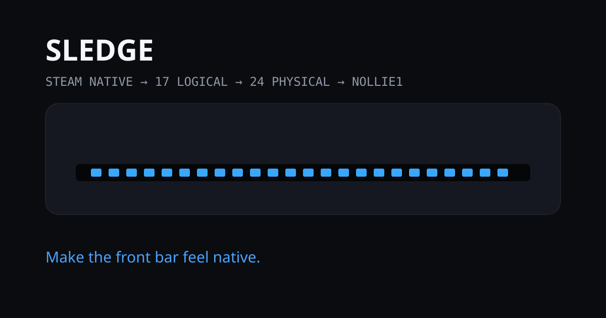
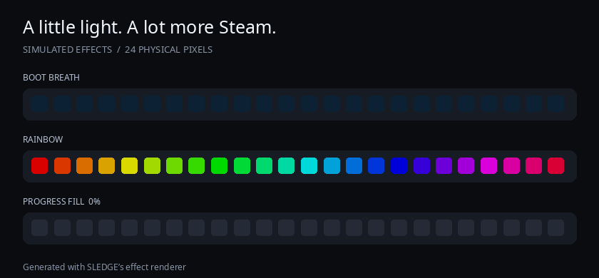

<p align="center">
  
</p>

# SLEDGE

**Steam Lighting Effects Daemon for Generic Equipment**

Give your custom LED hardware a Steam-native front-light experience. Pick colors and effects in Game Mode; SLEDGE translates Steam's light state onto your physical strip.

[Get the install package](public/sledge/sledge.zip) · [Install](#install) · [Troubleshooting](#troubleshooting) · [Detailed guide](public/sledge/README.md)

## See it in action



*Boot breathing, rainbow, and progress fill—generated with SLEDGE's effect renderer.*

- **Game Mode controls:** Steam's Front Lights settings control ordinary colors, brightness, and effects.
- **Direct Nollie output:** the validated controller uses CDC serial; OpenRGB is optional.
- **Your strip, your direction:** configurable LED count, mapping, and orientation.
- **Automatic startup:** user service and kernel-shim boot registration.
- **Thermal override:** red at 85 °C, clearing at or below 80 °C by default.
- **Local controls:** fallback effects, physical mapping, and diagnostics in your browser.

## Validated hardware

| Component | Tested configuration |
| --- | --- |
| Computer | BC-250 motherboard running SteamOS |
| Controller | Nollie1, USB `16d5:2a01`, CDC serial |
| LEDs | 24 addressable 5 V WS2812B pixels, cut from a 144 LEDs/m strip |
| Reference enclosure | NexGen3D Redux; not required by SLEDGE |

Other supported controller paths exist in the code, but this is the hardware-tested configuration. Strip density is not a protocol requirement. SLEDGE maps Steam's 17 logical pixels onto your configured physical count.

## Install

### 1. Check prerequisites in Desktop Mode

You need Python 3, Bash, a compiler and `make`, administrator access through `sudo`, and **headers matching the running kernel**. The installer does not download these prerequisites.

Open Konsole and check:

```bash
uname -r
test -f "/usr/lib/modules/$(uname -r)/build/Makefile" && echo "Header build tree found"
command -v python3 gcc make modinfo sudo
ls -l /dev/serial/by-id/
```

For the validated Nollie1, the serial list should include `usb-nollie.cn_Nollie1_…-if00`. A header directory alone does not prove an exact match: use the official header package for your running SteamOS kernel. If any prerequisite is missing, see [preparing SteamOS](docs/INSTALL.md#preparing-steamos) before continuing.

### 2. Download, extract, install

Download [sledge.zip](public/sledge/sledge.zip) using GitHub's **Download raw file** button. Extract it into a folder you will keep, then open a terminal **inside the extracted folder** and run:

```bash
bash install.sh --with-shim
```

Run this as your normal desktop user, **not** `sudo bash install.sh`. The installer requests administrator access for system changes, builds the shim for the running kernel, and starts your user service. On SteamOS it temporarily disables filesystem read-only protection for installation and restores it afterward. Existing SLEDGE settings are preserved.

If headers do not match or the module fails to load, stop and inspect the error. Do not force-load a module or disable signature verification. The package is linked from this branch; it is not a claim that a tagged release is already published.

### 3. Let Steam take control

Enter Game Mode → **Settings → Customization → Front Lights**, then change a color or effect. If Steam was already open during installation, restart Steam/Game Mode if the controls have not appeared.

In Desktop Mode, open **[SLEDGE Control](http://127.0.0.1:1873/)** on the same machine. Expected status after Steam writes:

```text
owner:    steam-native
backend:  cdc
device:   /dev/serial/by-id/usb-nollie.cn_Nollie1_…-if00
```

`awaiting Steam write` is normal before Steam sends its first setting. Finish with a normal reboot and confirm that the lights return automatically.

## Daily use

Use **Steam Front Lights** for ordinary lighting. Use the local control page for fallback behavior, LED count, mapping, direction, and diagnostics. Saving a backend change shows a persistent restart notice; apply it with:

```bash
systemctl --user restart sledge.service
```

Steam remote debugging and CEF fallback are **off by default**. Native lighting does not need them. Advanced opt-in instructions are in the [detailed guide](public/sledge/README.md#first-install).

## After a SteamOS kernel update

The shim must match the new **running kernel**. Install its official matching headers, then run this from your saved installation folder:

```bash
bash install.sh --repair-shim
```

This repairs the kernel shim and boot registration while preserving the daemon and settings. Never copy an old `.ko` into a new kernel's directory. See [repair and verification](docs/INSTALL.md#after-a-kernel-update).

## Troubleshooting

| Symptom | First check |
| --- | --- |
| Missing headers or build failure | Confirm `uname -r`, official matching headers, and compiler tools. Stop on a mismatch. |
| Front Lights missing | Confirm the shim loaded, then restart Steam/Game Mode. |
| `awaiting Steam write` | Change a Front Lights setting in Game Mode. |
| Controller not found | Check USB connection and the Nollie entry under `/dev/serial/by-id/`. |
| Direction is reversed | Change **LED Direction** in SLEDGE Control and save. |
| Backend saved but unchanged | Restart `sledge.service`; the UI shows when this is required. |
| Lights fail after OS update | Rebuild the shim for the new kernel using `--repair-shim`. |

Useful diagnostics:

```bash
systemctl --user status sledge.service --no-pager
journalctl --user -u sledge.service -b --no-pager -n 60
curl --fail http://127.0.0.1:1873/api/status
steamos-readonly status
```

[Open an issue](https://github.com/j0shm1lls/SLEDGE/issues) with the kernel version, controller model, and relevant error. Remove personal paths or other private details from logs before posting.

## How it works

**Steam Front Lights → Valve-compatible shim → SLEDGE renderer → physical mapping → Nollie → LEDs**

Steam compatibility names stay unchanged: `valve-leds[0..16]`, `/dev/valve-leds-shim`, and `leds-valve-shim`. SLEDGE's thermal override takes priority over ordinary light states. Firmware/POST colors are not emulated.

The README preview lives entirely in this repository. No hosted website is needed; the local control UI ships in the install package. Preview app source remains available for development.

## Development and attribution

Runtime: Python standard library plus the kernel shim. No Node.js installation is needed to use SLEDGE. See [the package guide](public/sledge/README.md) for architecture and acceptance checks. Run `python3 -m unittest discover -s public/sledge/tests` for the runtime tests; frontend development uses the commands in `package.json`.

The kernel shim is GPL-2.0+; see its [license](public/sledge/kernel/LICENSE) and [provenance](public/sledge/kernel/PROVENANCE.md). A repository-wide license has not yet been selected. SLEDGE is an independent project, not an official Valve, Nollie, or NexGen3D product.
